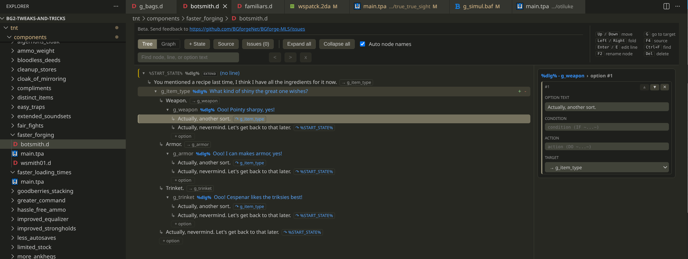
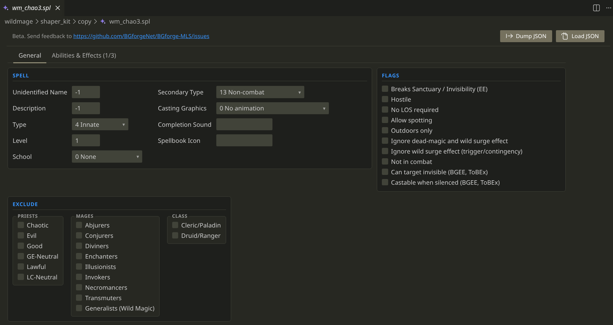
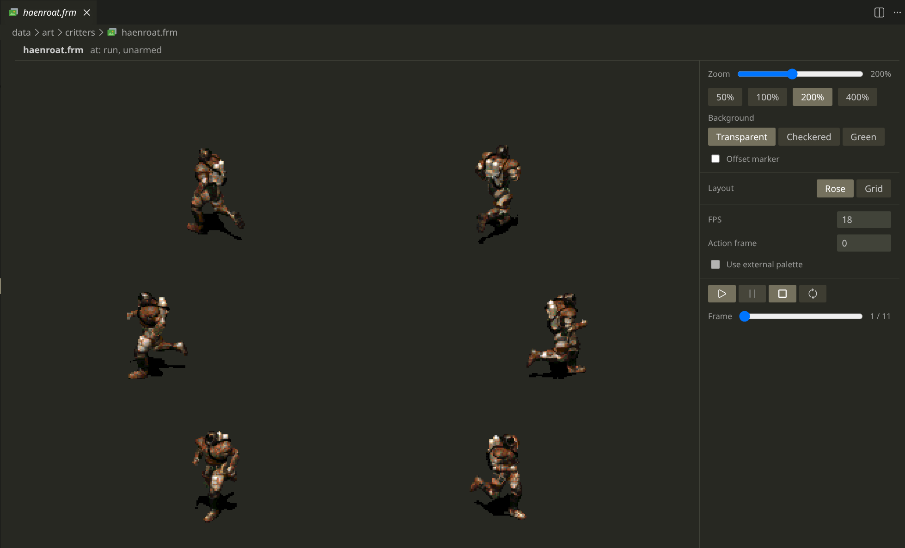

# BGforge multi-language server

BGforge MLS is a collection of tools for working with classic RPG modding languages and file formats. It supports [Star-Trek Scripting Language](https://falloutmods.fandom.com/wiki/Fallout_1_and_Fallout_2_scripting_-_commands,_reference,_tutorials) (`.ssl`) used in Fallout 1 and 2, several [WeiDU](https://weidu.org/~thebigg/README-WeiDU.html) and [Infinity Engine](https://iesdp.bgforge.net) formats (`.d`, `.baf`, `.tp2`, `.tra`, `.2da`), [Sword Coast Stratagems Scripting Language](https://www.gibberlings3.net/forums/topic/13725-coding-scripts-in-ssl-some-lessons/) (`.ssl`, `.slb`), and the TypeScript-based languages [TSSL](https://forums.bgforge.net/viewtopic.php?p=2574), [TBAF](https://forums.bgforge.net/viewtopic.php?t=448), and [TD](https://forums.bgforge.net/viewtopic.php?t=1333).

Originally a VS Code extension, it now also works with various other editors. Setup guides are available for [Sublime](docs/editors/sublime-text.md), [Neovim](docs/editors/neovim.md), [Emacs](docs/editors/emacs.md), [JetBrains](docs/editors/jetbrains.md), [Helix](docs/editors/helix.md), [Zed](docs/editors/zed.md), [Kate](docs/editors/kate.md), [Notepad++](docs/editors/notepadpp.md), and [Geany](docs/editors/geany.md). Standalone LSP server is [published](https://www.npmjs.com/package/@bgforge/mls-server) in NPM.

- [**Languages**](#languages): Fallout SSL; WeiDU BAF, D, TP2.
- [**TypeScript-based languages**](#typescript-based-languages): TSSL, TBAF, TD.
- [**Other formats**](#other-formats): TRA, MSG, 2DA; Fallout worldmap.txt, scripts.lst; weidu.log.
- [**Binary formats**](#binary-formats): Fallout PRO, MAP; Infinity ITM, SPL, EFF, CRE.
- [**Animations**](#animation-viewer): Fallout FRM; Infinity BAM.
- [**GitHub Actions**](#github-actions): format, transpile, compile, convert binaries to JSON and back.
- [**Installation**](#installation)
- [**Hotkeys**](#hotkeys)
- **Screenshots**: [completion](#infinity-engine-highlighting-and-completion), [hover](#fallout-highlighting-and-hovers), [error reporting](#error-reporting), [dialog editor](#dialog-editor), [animation viewer](#animation-viewer).
- [**Forum**](https://forums.bgforge.net/viewforum.php?f=35)

## Languages

| Feature           |          Fallout SSL           |     WeiDU BAF/SSL      | WeiDU D |           WeiDU TP2            |
| ----------------- | :----------------------------: | :--------------------: | :-----: | :----------------------------: |
| Extensions        |          `.ssl`, `.h`          | `.baf`, `.ssl`, `.slb` |  `.d`   | `.tp2`, `.tpa`, `.tph`, `.tpp` |
| Completion        |               ✓                |           ✓            |    ✓    |               ✓                |
| Hover             |               ✓                |           ✓            |    ✓    |               ✓                |
| Signature help    |               ✓                |                        |         |                                |
| Go to definition  |               ✓                |                        |    ✓    |               ✓                |
| Find references   |               ✓                |                        |    ✓    |               ✓                |
| Formatting        |               ✓                |           ✓            |    ✓    |               ✓                |
| Document symbols  |               ✓                |                        |    ✓    |               ✓                |
| Workspace symbols |               ✓                |                        |    ✓    |               ✓                |
| Semantic tokens   |               ✓                |                        |         |               ✓                |
| Rename            |               ✓                |                        |    ✓    |           Same file            |
| Inlay hints       |             `.msg`             |         `.tra`         | `.tra`  |             `.tra`             |
| Diagnostics       |               ✓                |           ✓            |    ✓    |               ✓                |
| JSDoc             |               ✓                |                        |    ✓    |               ✓                |
| Folding           |               ✓                |           ✓            |    ✓    |               ✓                |
| Dialog editor     |               ✓                |                        |    ✓    |                                |
| Compiler          | [ssl](compilers/ssl/README.md) |                        |         |                                |

Compiled Fallout `.int` scripts open as editable SSL - highlighting, outline and search - and save back over the `.int` in place. Local and argument names are not stored in a compiled script, so those are generated; a script that cannot be structured back opens as a read-only instruction listing.

## TypeScript-based languages

These are TypeScript-like language subsets for writing mods. TSSL compiles straight to Fallout bytecode; TBAF and TD generate WeiDU source, which WeiDU then installs.

They bring the TypeScript type system, many TypeScript features, and better tooling to modding.

| Language | Extension | Output | Inlay Hints | Dialog Editor |
| -------- | --------- | ------ | :---------: | :-----------: |
| TSSL     | .tssl     | .int   |    .msg     |       ✓       |
| TBAF     | .tbaf     | .baf   |    .tra     |               |
| TD       | .td       | .d     |    .tra     |       ✓       |

**[TSSL](compilers/tssl/docs/README.md)** (.tssl) compiles `.int`. Optionally can transpile to `.ssl` as well. Companion project: [FOlib](https://github.com/BGforgeNet/folib).

**[TBAF](transpilers/tbaf/docs/README.md)** (.tbaf) compiles to WeiDU BAF. Important additions include functions, loops, variables, arrays, enums. Companion project: [IETS](https://github.com/BGforgeNet/iets).

**[TD](transpilers/td/docs/README.md)** (.td) compiles to WeiDU D. Same features as TBAF, but has different structure. Also uses IETS.

## Other formats

| Format / Extensions  | Highlighting | Completion | Hover | GoTo | References | Formatting |
| -------------------- | :----------: | :--------: | :---: | :--: | :--------: | :--------: |
| Fallout worldmap.txt |      ✓       |     ✓      |   ✓   |      |            |            |
| Fallout MSG          |      ✓       |            |       |      |     ✓      |     ✓      |
| Fallout scripts.lst  |      ✓       |            |       |      |            |     ✓      |
| WeiDU TRA            |      ✓       |            |       |      |     ✓      |     ✓      |
| WeiDU.log            |      ✓       |            |       | tp2  |            |            |
| Infinity 2DA         |      ✓       |            |       |      |            |     ✓      |

## Binary formats

Fallout PRO and MAP files, and Infinity Engine ITM, SPL, EFF, and CRE files, have a built-in [binary editor](#binary-editor) with JSON dump/load support.

## GitHub Actions

[GitHub Actions](actions/README.md) keep generated artifacts in mod repositories up to date: they refresh binary-format JSON snapshots, format Fallout/WeiDU sources, and regenerate transpiler output, committing the results back or simply verifying they match. A fourth compiles TSSL to Fallout INT bytecode as a CI check.

## Installation

1. Install BGforge MLS from the VS Code Marketplace.
   Alternatively, download the package from [GitHub Releases](https://github.com/BGforgeNet/BGforge-MLS/releases) and install it manually.
1. Check [general settings](docs/settings.md).
1. Check [file associations](docs/file_associations.md).
1. Check [hotkeys](#hotkeys).
1. Enable [custom theme](docs/theme.md) and [icon theme](docs/icon-theme.md).
1. (Infinity Engine) Install [IElib](https://ielib.bgforge.net).

## Hotkeys

- `CTRL+R`: compile a Fallout `.ssl` or `.tssl` file, transpile a `.tbaf` or `.td`, or parse a WeiDU file, reporting [errors](#error-reporting) if any.
- `CTRL+SHIFT+V`: open the [Dialog Editor](#dialog-editor) (SSL, TSSL, D, TD files).
- Standard VS Code hotkeys:
  - `CTRL+SHIFT+O`: document symbols
  - `CTRL+T`: workspace symbols

## Screenshots

### Infinity Engine highlighting and completion

### Fallout highlighting and hovers

### Dialog editor

Visual dialog editor for SSL, TSSL, D, and TD files. Open with `CTRL+SHIFT+V` or the command palette. Shows states, transitions, and resolved translation strings.

Compiled Infinity Engine `.dlg` files open in the same editor, read-only: the states, transitions, triggers and actions the file stores. Spoken text lives in the game's `dialog.tlk`, so it resolves once a game is open - the editor offers a button to open one when there is none.

### Error reporting

### Binary editor

### Animation viewer

Supported animation formats are BAM and FRM. PNG import/export is available, as well as cross-format save (conversion).

